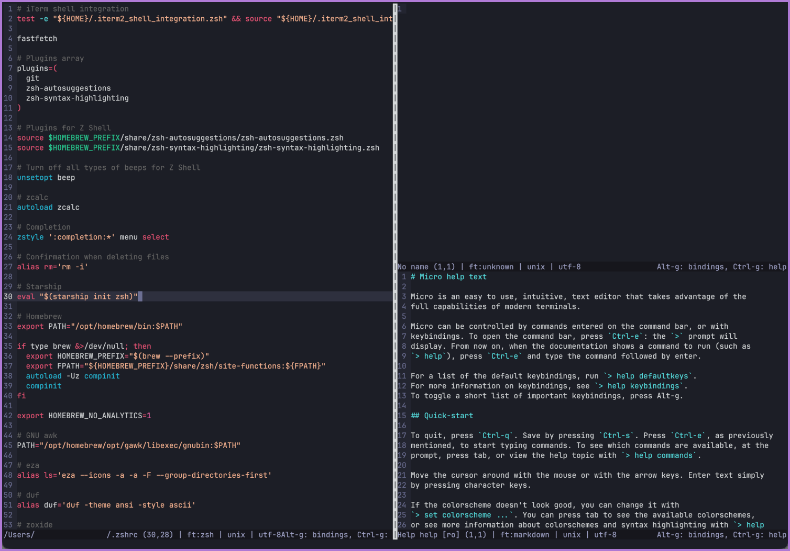

# Horizon Micro
Horizon for the Micro text editor.

 

* [Micro text editor](https://micro-editor.github.io/)

* [Horizon color scheme](https://horizontheme.netlify.app/) 

Place file in ~/.config/micro/colorschemes/ (create a new folder named colorschemes if non-existing).

Open the Micro text editor, press control+e and type "set colorscheme horizon" (without quotation marks) and press enter.

Done.

